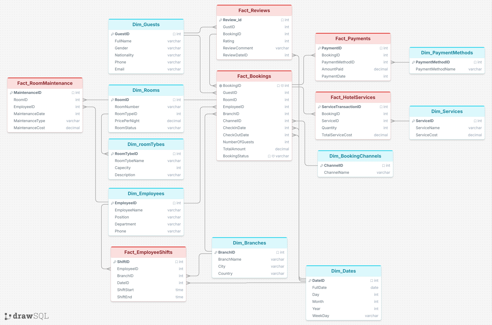

# Hotel-Data-Warehouse-SQL
Hotel Data Warehouse project designed using SQL Server and Star Schema modeling techniques. Includes fact &amp; dimension tables, relationships, constraints, and sample data for hotel analytics and reporting.
# Hotel Data Warehouse Project

## Overview

This project is a Hotel Data Warehouse designed using SQL Server and Star Schema modeling techniques.

The system stores and analyzes hotel operational data including:

* Guests
* Bookings
* Payments
* Hotel Services
* Employee Shifts
* Room Maintenance
* Customer Reviews

The project demonstrates Data Warehousing concepts, relational database design, and SQL development skills.

---

# Technologies Used

* SQL Server
* T-SQL
* Star Schema Modeling
* ERD Design

---

# Database Design

## Dimension Tables

* Dim_Guests
* Dim_Dates
* Dim_Rooms
* Dim_RoomTypes
* Dim_Employees
* Dim_PaymentMethods
* Dim_Services
* Dim_Branches
* Dim_BookingChannels

## Fact Tables

* Fact_Bookings
* Fact_Payments
* Fact_HotelServices
* Fact_RoomMaintenance
* Fact_EmployeeShifts
* Fact_Reviews

---

# Features

* Primary Keys & Foreign Keys
* Identity Columns
* Star Schema Design
* Data Integrity Constraints
* Review Rating Validation
* Sample Data Insertion
* Business-Oriented Relationships

---

# Example Bussiness Questions

This warehouse can help answer questions such as:

* What is the total hotel revenue?
* Which room types are most booked?
* What are the highest-rated services?
* Which booking channels generate the most bookings?
* What is the average customer rating?

---

# Sample SQL Queries

## Total Revenue

```sql
SELECT SUM(TotalAmount) AS TotalRevenue
FROM Fact_Bookings;
```

## Average Review Rating

```sql
SELECT AVG(Rating) AS AverageRating
FROM Fact_Reviews;
```

## Most Used Hotel Services

```sql
SELECT 
    s.ServiceName,
    SUM(h.Quantity) AS TotalUsage
FROM Fact_HotelServices h
JOIN Dim_Services s
ON h.ServiceID = s.ServiceID
GROUP BY s.ServiceName;
```
## Analytics


```sql
-- Total Revenue

SELECT SUM(TotalAmount) AS TotalRevenue
FROM Fact_Bookings;

-- Average Rating
SELECT AVG(Rating) AS AvgRating
FROM Fact_Reviews;

-- Most Used Services
SELECT 
    s.ServiceName,
    SUM(h.Quantity) AS TotalUsage
FROM Fact_HotelServices h
JOIN Dim_Services s
ON h.ServiceID = s.ServiceID
GROUP BY s.ServiceName;
---

```

# ERD Diagram

---


# Author

Mohamed Ashraf
